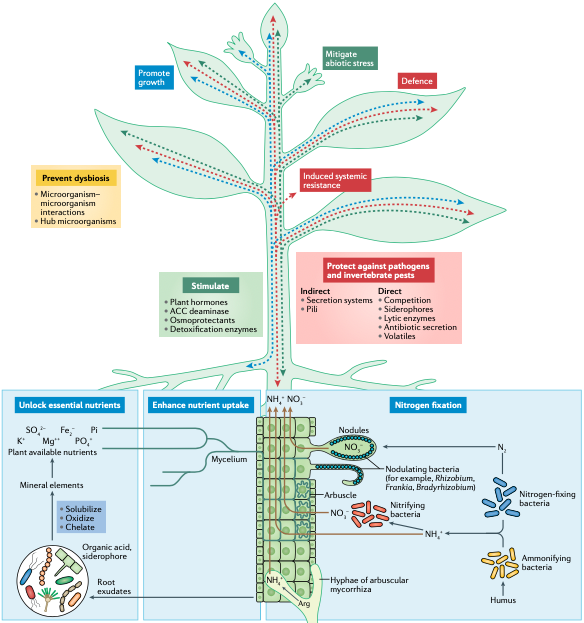
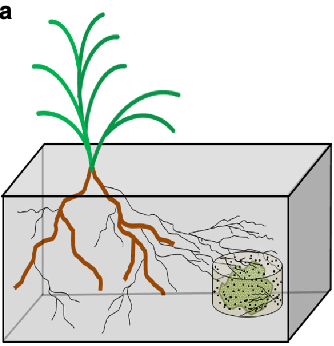

```{r setup, include=FALSE, cache=FALSE}
# TO render: rmarkdown::render('master.Rmd', 'xaringan::moon_reader')

# set working directory to docs folder
setwd(here::here())

# Set global R options
options(htmltools.dir.version = FALSE, servr.daemon = TRUE)

# Set global knitr chunk options
knitr::opts_chunk$set(
  fig.align = "center", 
  cache = TRUE,
  error = FALSE,
  message = FALSE, 
  warning = FALSE, 
  collapse = TRUE 
)

# Set bibliography
library(RefManageR)
BibOptions(check.entries = FALSE,
           bib.style = "authoryear",
           cite.style = "authoryear",
           style = "markdown",
           hyperlink = FALSE,
           max.names = 2,
           dashed = FALSE)
bib <- ReadBib("biblio/bib.bib", check = FALSE)
```

```{r xaringanExtra, echo=FALSE}
library(xaringanExtra)
use_tile_view() 
use_panelset()
use_search(show_icon = FALSE)
use_scribble()
```

```{r xaringanThemer, echo = FALSE}
library(xaringanthemer)
extra_css <- list(
    ".marco1" = list("font-family" = "Sofia"),
    ".fl img" = list(float = "right"),
    ".fl p" = list(float = "right"),
    ".orange" = list("color" = "#FF961C"),
    ".content-box" = list(
        "border-radius" = "15px",
        "overflow" = "hidden",
        "display" = "block",
        "text-align" = "center",
        "padding" = "2px",
	      "background-color" = "#FF961C",
        "margin" = "15px"),
    ".f60" = list("font-size" = "60px"),
    ".f20" = list("font-size" = "20px"),
    ".f40" = list("font-size" = "40px"),
    ".center" = list(
      margin = "auto",
      width = "50%",
      padding = "10px"),
    ".list1 p, .list1 ul li, .list1 ol li" = list(
      "line-height" = "27px",
      "font-size" = "25px",
      "margin" = "10px"),
    ".list2 p, .list2 ul li, .list2 ol li" = list(
      "line-height" = "23px",
      "font-size" = "20px",
      "margin" = "0px"),
    ".list3 p, .list3 ul li, .list3 ol li" = list(
      "line-height" = "18px",
      "font-size" = "15px",
      "margin" = "0px"),
      ".ml20" = list(
       "margin-left" = "20px"),
    ".m5h4 h4" = list("margin" = "5px"),
    ".m5p p" = list("margin" = "5px")
  )
style_extra_css(css = extra_css, outfile = "custom.css")
```


class: title-slide


# .font170[MICROBIOMA E MICROBIOTA]

<br><br><br><br>


.marco[
.tada[Marco Chiapello]
<br>
2021-10-20
<br>
marco.chiapello@unito.it
]


---

class: center, middle, clear

```{r echo=FALSE, out.width="400px"}

```

.m0tbp[https://bit.ly/39coIbU]

---
layout: true

# Last lesson recap

---

.pull-left[
<br>
.m0p[
.h25o[
1. DNA Metabarcoding 

1. Several techniques can be employed to decipher the microbiota functions

1. System biology is the discipline that integrates the -omics techniques to formulate models that describe the structure of the system
]
]
]

---

layout: true
# Functions of plant-associated microbiomes

---

class: inverse, middle, center 

----

---

.pull-left[
.m0p[
```{r echo=FALSE, out.width="530px"}

```
]]

.pull-right[

.h25up[
<br>
The plant-associated microbiome can provide benefits to the plant through various direct or indirect mechanisms

- nutrient acquisition (blue)
  
- stress control (green)
  
- defence against pathogens and pests (red)


]
]

---
class: clear, middle, center

# .black[Nutrient acquisition]

----

---

## Experimental design

.pull-left[
.h25up[
.m0tbp[

- `r fontawesome::fa("flask", fill = "grey")` .font70[The experimental design allowed to assess the individual and combined contributions of AM fungi and the rest of the soil microbial community to plant N acquisition from organic matter]

- .font70[The 6 mesocosm treatments included]


.tt[
|Plot|Fungi|soil inocula| soil fertilization |
|---|:---:|:---:|:---:|
|control|`r fontawesome::fa("minus-circle", fill = "red")` | `r fontawesome::fa("minus-circle", fill = "red")`| none |
|microbes (N0)| `r fontawesome::fa("minus-circle", fill = "red")`| `r fontawesome::fa("plus-circle", fill = "green")`| 0 kg N / ha per year|
|AM fungi| `r fontawesome::fa("plus-circle", fill = "green")`| `r fontawesome::fa("minus-circle", fill = "red")`| none |
|AM fungi + microbes (N196)| `r fontawesome::fa("plus-circle", fill = "green")`| `r fontawesome::fa("plus-circle", fill = "green")`| 196 kg N / ha per year|
|AM fungi + microbes (N28)| `r fontawesome::fa("plus-circle", fill = "green")`| `r fontawesome::fa("plus-circle", fill = "green")`| 28 kg N / ha per year|
|AM fungi + microbes (N0)| `r fontawesome::fa("plus-circle", fill = "green")`| `r fontawesome::fa("plus-circle", fill = "green")`| 0 kg N / ha per year|


]
]
]
]


.pull-right[
.m0p[

.center[.font80[Mesocosm design]]

```{r echo=FALSE, out.width="200px"}

```

.h20[
.m0tbp[
- Terrestrial ecosystems experience substantial N enrichment due to atmospheric deposition and fertilizer applications

- Long-term N enrichment of grassland soils results in substantial changes in microbial community structure and functional gene representation

- The particular mechanisms through which long-term N enrichment influences plant-biotic interactions and plant productivity are not fully understood
]

]]]


???

.h201[

- Importanza del disegno sperimentale 

- model grass Brachypodium distachyon

- inoculum of fresh grassland soil containing whole soil microbial communities that had been exposed to an N enrichment gradient for eight years

- Un mesocosmo ( meso o 'media' e -cosm 'mondo' ) è un qualsiasi sistema sperimentale all'aperto che esamina l'ambiente naturale in condizioni controllate. In questo modo gli studi mesocosmo forniscono un legame tra indagini sul campo e gli esperimenti di laboratorio altamente controllate.

- La fissazione dell'azoto atmosferico o azotofissazione consiste nella riduzione, tramite la nitrogenasi, dell'azoto molecolare (N2) in azoto ammonico (NH3)

- La nitrificazione e' la trasformazione dell'ammoniaca (NH3) e ioni ammonio (NH4+) in ioni nitrito (NO2-) e successivamente ioni nitrato (NO3-).

- La denitrificazione e'  un processo nell'ambito del ciclo dell'azoto nel terreno, che comporta la riduzione dell'azoto nitrico con formazione di gas che si liberano nell'atmosfera
]

---
layout: true

# Questions 


---


.m0tbp[
.center[.font50px[`r fontawesome::fa("question-circle", fill = "black")`]]
]


